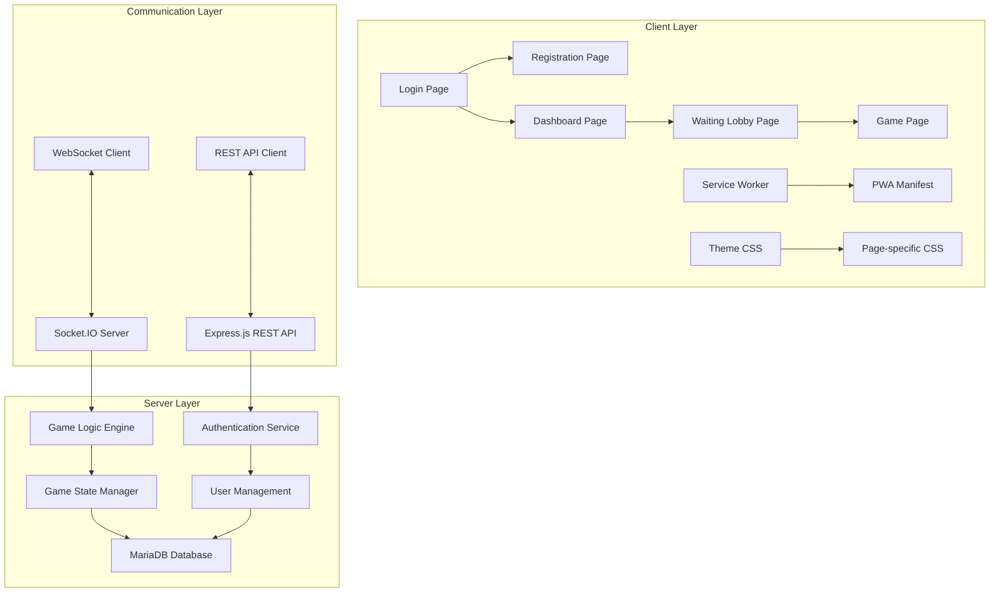

# Design Document

## Overview

The Contract Crown PWA is designed as a mobile-first, real-time multiplayer card game application. The architecture follows a client-server model with vanilla JavaScript frontend and Node.js backend, emphasizing modular design, responsive UI, and real-time communication through WebSockets. The application implements a structured page flow with dedicated HTML, CSS, and JavaScript files for each functionality, ensuring maintainability and theme customization capabilities.

## Architecture

### High-Level Architecture



### Technology Stack

- **Frontend**: Vanilla JavaScript, HTML5, CSS3
- **Backend**: Node.js, Express.js, Socket.IO
- **Database**: MariaDB
- **Authentication**: JWT (JSON Web Tokens)
- **Real-time Communication**: WebSocket (Socket.IO)
- **PWA Features**: Service Worker, Web App Manifest

## Components and Interfaces

### Frontend Components

#### 1. Page Structure
Each page follows a consistent structure with dedicated files:
- `page-name.html` - HTML structure
- `page-name.css` - Page-specific styles
- `page-name.js` - Page functionality (max 300-400 lines)

#### 2. Core JavaScript Modules

**Authentication Module (`auth.js`)**
```javascript
class AuthManager {
    login(credentials)
    register(userData)
    logout()
    getToken()
    isAuthenticated()
}
```

**WebSocket Manager (`websocket.js`)**
```javascript
class WebSocketManager {
    connect()
    disconnect()
    emit(event, data)
    on(event, callback)
    getConnectionStatus()
}
```

**Game State Manager (`gameState.js`)**
```javascript
class GameStateManager {
    updateGameState(state)
    getCurrentPlayer()
    getPlayerHand()
    getTrumpSuit()
    getScores()
}
```

**UI Components (`ui-components.js`)**
```javascript
class UIComponents {
    showConnectionStatus(status)
    renderCard(card)
    showNotification(message)
    updatePlayerStatus(playerId, status)
}
```

#### 3. Page-Specific Components

**Login Page (`login.html`, `login.css`, `login.js`)**
- Clean, modern login form
- Input validation
- Error message display
- Link to registration page

**Registration Page (`register.html`, `register.css`, `register.js`)**
- User registration form
- Client-side validation
- Success/error feedback
- Redirect to login after successful registration

**Dashboard Page (`dashboard.html`, `dashboard.css`, `dashboard.js`)**
- Create room button
- Join room input with game code
- User profile display
- Logout functionality

**Waiting Lobby Page (`lobby.html`, `lobby.css`, `lobby.js`)**
- 4 player slots display
- Ready status indicators
- Team formation button (host only)
- Start game button (host only, when all ready)
- Real-time player updates

**Game Page (`game.html`, `game.css`, `game.js`)**
- Game table layout
- Player hand display
- Trick area
- Score display
- Trump indicator
- Turn indicator
- Game messages

### Backend Components

#### 1. Server Architecture

**Main Server (`server.js`)**
```javascript
const express = require('express');
const http = require('http');
const socketIo = require('socket.io');
const cors = require('cors');

class GameServer {
    constructor()
    setupMiddleware()
    setupRoutes()
    setupSocketIO()
    start()
}
```

**Authentication Service (`auth-service.js`)**
```javascript
class AuthService {
    register(userData)
    login(credentials)
    verifyToken(token)
    generateToken(user)
}
```

**Game Logic Engine (`game-engine.js`)**
```javascript
class GameEngine {
    createGame(hostId)
    joinGame(gameCode, playerId)
    startGame(gameId)
    dealCards(gameId)
    declareTrump(gameId, playerId, suit)
    playCard(gameId, playerId, card)
    calculateTrickWinner(cards)
    updateScores(gameId)
    checkGameEnd(gameId)
}
```

**Game State Manager (`game-state.js`)**
```javascript
class GameStateManager {
    getGameState(gameId)
    updateGameState(gameId, state)
    addPlayer(gameId, player)
    removePlayer(gameId, playerId)
    setPlayerReady(gameId, playerId, ready)
}
```

#### 2. Database Models

**User Model**
```sql
CREATE TABLE users (
    user_id VARCHAR(36) PRIMARY KEY,
    username VARCHAR(50) UNIQUE NOT NULL,
    email VARCHAR(100) UNIQUE NOT NULL,
    password_hash VARCHAR(255) NOT NULL,
    created_at TIMESTAMP DEFAULT CURRENT_TIMESTAMP,
    last_login TIMESTAMP,
    total_games_played INT DEFAULT 0,
    total_games_won INT DEFAULT 0
);
```

**Game Model**
```sql
CREATE TABLE games (
    game_id VARCHAR(36) PRIMARY KEY,
    game_code VARCHAR(10) UNIQUE NOT NULL,
    status ENUM('waiting', 'in_progress', 'completed', 'cancelled') NOT NULL,
    host_id VARCHAR(36) NOT NULL,
    created_at TIMESTAMP DEFAULT CURRENT_TIMESTAMP,
    started_at TIMESTAMP,
    completed_at TIMESTAMP,
    winning_team_id VARCHAR(36),
    target_score INT NOT NULL DEFAULT 52
);
```

## Data Models

### Frontend Data Models

#### Game State Model
```javascript
const gameState = {
    gameId: 'uuid',
    status: 'waiting|in_progress|completed',
    players: [
        {
            userId: 'uuid',
            username: 'string',
            seatPosition: 1-4,
            teamId: 'uuid',
            isReady: boolean,
            isHost: boolean,
            isCurrentTurn: boolean,
            hand: [{ suit: 'string', rank: 'string' }],
            tricksWon: number
        }
    ],
    teams: [
        {
            teamId: 'uuid',
            teamNumber: 1|2,
            currentScore: number,
            isDeclaringTeam: boolean,
            players: ['userId1', 'userId2']
        }
    ],
    currentRound: {
        roundNumber: number,
        dealerUserId: 'uuid',
        firstPlayerUserId: 'uuid',
        trumpSuit: 'Hearts|Diamonds|Clubs|Spades',
        declaringTeamId: 'uuid',
        currentTrick: {
            trickNumber: 1-8,
            leadingPlayerUserId: 'uuid',
            cardsPlayed: [
                { userId: 'uuid', card: { suit: 'string', rank: 'string' } }
            ]
        }
    }
};
```

#### Card Model
```javascript
const card = {
    suit: 'Hearts|Diamonds|Clubs|Spades',
    rank: 'A|K|Q|J|10|9|8|7',
    value: number // for comparison
};
```

### Backend Data Models

#### Database Schema Extensions
```sql
-- Game Players Table
CREATE TABLE game_players (
    game_player_id VARCHAR(36) PRIMARY KEY,
    game_id VARCHAR(36) NOT NULL,
    user_id VARCHAR(36) NOT NULL,
    team_id VARCHAR(36),
    seat_position INT NOT NULL,
    is_ready BOOLEAN DEFAULT FALSE,
    is_host BOOLEAN DEFAULT FALSE,
    current_hand JSON,
    tricks_won_current_hand INT DEFAULT 0,
    FOREIGN KEY (game_id) REFERENCES games(game_id) ON DELETE CASCADE,
    FOREIGN KEY (user_id) REFERENCES users(user_id)
);

-- Teams Table
CREATE TABLE teams (
    team_id VARCHAR(36) PRIMARY KEY,
    game_id VARCHAR(36) NOT NULL,
    team_number INT NOT NULL,
    current_score INT DEFAULT 0,
    player1_id VARCHAR(36),
    player2_id VARCHAR(36),
    FOREIGN KEY (game_id) REFERENCES games(game_id) ON DELETE CASCADE
);

-- Game Rounds Table
CREATE TABLE game_rounds (
    round_id VARCHAR(36) PRIMARY KEY,
    game_id VARCHAR(36) NOT NULL,
    round_number INT NOT NULL,
    dealer_user_id VARCHAR(36) NOT NULL,
    first_player_user_id VARCHAR(36) NOT NULL,
    trump_suit VARCHAR(10),
    declaring_team_id VARCHAR(36),
    declaring_team_tricks_won INT DEFAULT 0,
    challenging_team_tricks_won INT DEFAULT 0,
    round_completed_at TIMESTAMP,
    FOREIGN KEY (game_id) REFERENCES games(game_id) ON DELETE CASCADE
);
```

## Error Handling

### Frontend Error Handling

#### Network Error Handling
```javascript
class ErrorHandler {
    handleNetworkError(error) {
        // Display user-friendly message
        // Implement retry mechanism
        // Log error for debugging
    }
    
    handleValidationError(field, message) {
        // Show field-specific error
        // Highlight invalid input
        // Provide correction guidance
    }
    
    handleGameError(errorCode, message) {
        // Display game-specific error
        // Provide context-appropriate action
        // Maintain game state consistency
    }
}
```

#### WebSocket Error Handling
```javascript
class WebSocketErrorHandler {
    handleConnectionLoss() {
        // Show reconnecting status
        // Attempt automatic reconnection
        // Sync state after reconnection
    }
    
    handleInvalidMove(error) {
        // Show move validation error
        // Highlight valid moves
        // Prevent invalid actions
    }
}
```

### Backend Error Handling

#### API Error Handling
```javascript
class APIErrorHandler {
    handleDatabaseError(error) {
        // Log detailed error
        // Return generic user message
        // Implement transaction rollback
    }
    
    handleAuthenticationError(error) {
        // Return 401 Unauthorized
        // Log security attempt
        // Clear invalid tokens
    }
    
    handleGameLogicError(error) {
        // Validate game state
        // Return specific error code
        // Maintain game integrity
    }
}
```

#### Game State Error Handling
```javascript
class GameStateErrorHandler {
    handleInvalidGameState(gameId) {
        // Reconstruct from database
        // Notify affected players
        // Log state corruption
    }
    
    handlePlayerDisconnection(gameId, playerId) {
        // Mark player as disconnected
        // Implement timeout mechanism
        // Handle game continuation
    }
}
```

## Testing Strategy

### Frontend Testing

#### Unit Testing with Cypress
```javascript
// Example test structure for each component
describe('Login Page', () => {
    it('should validate user credentials', () => {
        // Test login form validation
    });
    
    it('should handle authentication errors', () => {
        // Test error message display
    });
    
    it('should redirect after successful login', () => {
        // Test navigation flow
    });
});
```

#### Integration Testing
```javascript
describe('Game Flow Integration', () => {
    it('should complete full game flow', () => {
        // Test login → dashboard → lobby → game
    });
    
    it('should handle real-time updates', () => {
        // Test WebSocket communication
    });
});
```

#### Mobile Testing
```javascript
describe('Mobile Responsiveness', () => {
    it('should adapt to mobile viewport', () => {
        // Test responsive design
    });
    
    it('should handle touch interactions', () => {
        // Test mobile-specific interactions
    });
});
```

### Backend Testing

#### API Testing
```javascript
describe('Authentication API', () => {
    it('should register new users', () => {
        // Test user registration endpoint
    });
    
    it('should authenticate existing users', () => {
        // Test login endpoint
    });
});

describe('Game API', () => {
    it('should create new games', () => {
        // Test game creation endpoint
    });
    
    it('should handle game joining', () => {
        // Test game joining logic
    });
});
```

#### Game Logic Testing
```javascript
describe('Game Engine', () => {
    it('should correctly determine trick winners', () => {
        // Test trick calculation logic
    });
    
    it('should enforce suit-following rules', () => {
        // Test card play validation
    });
    
    it('should calculate scores correctly', () => {
        // Test scoring algorithm
    });
});
```

### End-to-End Testing
```javascript
describe('Complete Game Session', () => {
    it('should support full 4-player game', () => {
        // Test complete game from start to finish
    });
    
    it('should handle player disconnections', () => {
        // Test disconnection scenarios
    });
    
    it('should maintain game state consistency', () => {
        // Test state synchronization
    });
});
```

## Performance Considerations

### Frontend Optimization
- Lazy loading of game assets
- Efficient DOM manipulation
- Optimized WebSocket message handling
- Service Worker caching strategies
- Image optimization for card graphics

### Backend Optimization
- Database connection pooling
- Efficient game state management
- WebSocket room optimization
- Memory management for game sessions
- Database query optimization

### Mobile Optimization
- Touch-friendly UI elements
- Optimized for mobile networks
- Battery-efficient WebSocket usage
- Responsive image loading
- Minimal JavaScript bundle size