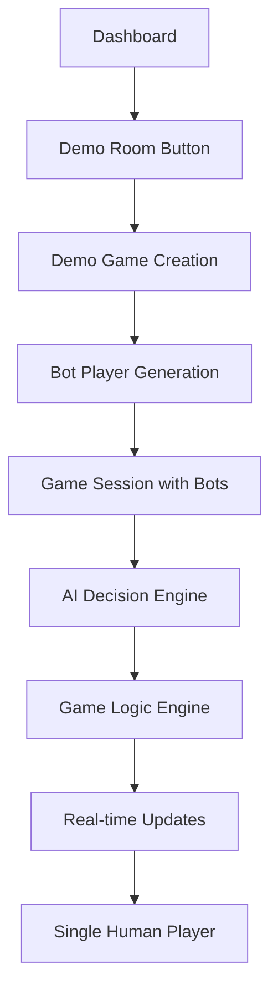
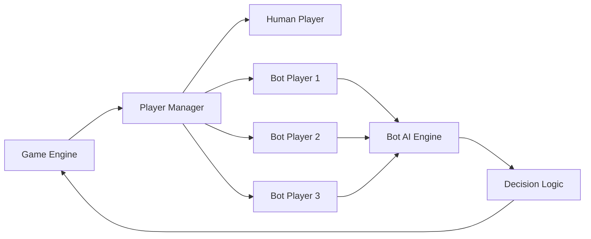

# Design Document

## Overview

This design outlines the implementation of a comprehensive gameplay testing system for Contract Crown, featuring a demo room with AI bots that allows single-player testing of all game mechanics. The system will extend the existing game infrastructure to support automated bot players while maintaining full compatibility with the real multiplayer experience.

## Architecture

### Demo Room System Architecture



### Bot Integration Architecture



## Components and Interfaces

### 1. Demo Room Manager

**Purpose:** Handles creation and management of demo game sessions

**Key Methods:**
- `createDemoRoom(userId)`: Creates a new demo game with bots
- `populateWithBots(gameId)`: Adds 3 AI bot players to the game
- `startDemoGame(gameId)`: Initiates the game with bot players

**Interface:**
```javascript
class DemoRoomManager {
    async createDemoRoom(userId) {
        // Create game session
        // Add user as player 1
        // Generate 3 bot players
        // Set game status to ready
        // Return game details
    }
}
```

### 2. Bot Player System

**Purpose:** Simulates human players with AI decision-making

**Key Components:**
- `BotPlayer`: Represents a single bot player
- `BotAI`: Contains decision-making logic
- `BotPersonality`: Defines playing style variations

**Interface:**
```javascript
class BotPlayer {
    constructor(id, name, personality) {
        this.id = id;
        this.name = name;
        this.personality = personality;
        this.hand = [];
    }
    
    async makeDecision(gameState, actionType) {
        // Analyze game state
        // Apply personality-based decision logic
        // Return valid action
    }
}
```

### 3. AI Decision Engine

**Purpose:** Provides intelligent decision-making for bot players

**Decision Types:**
- Trump Declaration: Choose trump suit based on hand strength
- Card Play: Select valid cards following game rules
- Strategic Play: Consider team dynamics and scoring

**Algorithm Framework:**
```javascript
class AIDecisionEngine {
    declareTrump(hand) {
        // Analyze suit distribution
        // Calculate trump potential
        // Return strongest suit
    }
    
    playCard(hand, gameState, trickState) {
        // Check suit-following requirements
        // Evaluate trump opportunities
        // Consider team strategy
        // Return optimal card
    }
}
```

### 4. Enhanced Game Engine

**Purpose:** Extends existing game engine to support bot players

**Modifications:**
- Bot player detection and handling
- Automated bot action processing
- Timing controls for bot actions
- Demo mode state management

**Interface Extensions:**
```javascript
class GameEngine {
    // Existing methods...
    
    isBotPlayer(playerId) {
        return this.players[playerId].isBot;
    }
    
    async processBotTurn(playerId) {
        const bot = this.players[playerId];
        const action = await bot.makeDecision(this.gameState);
        return this.processPlayerAction(playerId, action);
    }
}
```

### 5. Demo UI Enhancements

**Purpose:** Provides UI elements specific to demo mode

**Components:**
- Demo Room button on dashboard
- Bot player indicators in game
- Demo mode status display
- Enhanced debugging information

## Data Models

### Bot Player Model

```javascript
{
    id: "bot_uuid",
    name: "Bot Player 1",
    isBot: true,
    personality: "aggressive|conservative|balanced",
    difficulty: "easy|medium|hard",
    hand: [],
    teamId: "team_uuid",
    seatPosition: 2
}
```

### Demo Game Session Model

```javascript
{
    gameId: "demo_uuid",
    isDemoMode: true,
    humanPlayerId: "user_uuid",
    botPlayers: ["bot1_id", "bot2_id", "bot3_id"],
    gameState: "waiting|in_progress|completed",
    createdAt: timestamp
}
```

### Bot Decision Context

```javascript
{
    gameState: {
        currentRound: 1,
        trumpSuit: "hearts",
        currentTrick: {...},
        scores: {...}
    },
    playerHand: [...],
    actionType: "declare_trump|play_card",
    validActions: [...],
    teamMate: "player_id"
}
```

## Error Handling

### Bot Error Recovery

1. **Invalid Bot Decisions:** If a bot makes an invalid move, fallback to random valid action
2. **Bot Timeout:** If bot decision takes too long, auto-select first valid option
3. **Bot Disconnection:** Replace disconnected bot with new bot instance
4. **State Synchronization:** Ensure bot actions maintain game state consistency

### Demo Mode Error Handling

1. **Demo Creation Failure:** Display error and allow retry
2. **Bot Generation Failure:** Fallback to simplified bot logic
3. **Game State Corruption:** Reset demo game and restart
4. **Real-time Update Failures:** Implement retry mechanism for bot actions

## Testing Strategy

### Unit Testing

1. **Bot Decision Logic:** Test trump declaration and card play algorithms
2. **Demo Room Creation:** Verify proper game session setup with bots
3. **AI Engine:** Test decision-making under various game states
4. **Game Rule Validation:** Ensure bots follow all Contract Crown rules

### Integration Testing

1. **Bot-Human Interaction:** Test mixed human-bot gameplay
2. **Real-time Synchronization:** Verify bot actions update UI correctly
3. **Complete Game Flow:** Test full games from start to finish with bots
4. **Error Scenarios:** Test bot behavior during error conditions

### End-to-End Testing

1. **Demo Room Workflow:** Test complete demo room creation and gameplay
2. **All Game Features:** Verify every game mechanic works with bots
3. **Performance Testing:** Ensure bot decisions don't impact game performance
4. **Cross-browser Testing:** Test demo mode across different browsers

## Implementation Phases

### Phase 1: Demo Room Infrastructure
- Add demo room button to dashboard
- Implement demo game creation logic
- Create basic bot player structure
- Set up demo mode routing

### Phase 2: Bot AI Implementation
- Develop trump declaration AI
- Implement card play decision logic
- Add bot personality variations
- Create bot action timing system

### Phase 3: Game Engine Integration
- Integrate bots with existing game engine
- Implement bot turn processing
- Add demo mode state management
- Ensure real-time synchronization

### Phase 4: Testing and Validation
- Comprehensive testing of all game features
- Bot behavior validation
- Performance optimization
- Error handling verification

## Security Considerations

1. **Demo Mode Isolation:** Ensure demo games don't affect real game statistics
2. **Bot Authentication:** Prevent bots from being used in real multiplayer games
3. **Resource Management:** Limit concurrent demo games per user
4. **Data Privacy:** Ensure demo game data is properly cleaned up

## Performance Considerations

1. **Bot Decision Speed:** Implement configurable delays for realistic bot timing
2. **Memory Management:** Proper cleanup of bot instances and demo games
3. **Concurrent Demo Games:** Optimize server resources for multiple demo sessions
4. **Real-time Updates:** Efficient WebSocket handling for bot actions