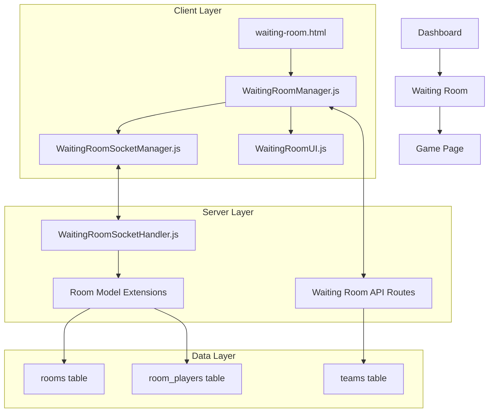

# Design Document

## Overview

The Waiting Room is a simplified, reliable replacement for the existing lobby functionality in the Contract Crown PWA. It provides a clean, real-time multiplayer coordination system that focuses on core functionality: player management, ready status tracking, and game initiation. The design emphasizes simplicity, reliability, and maintainability to address the bugs and complexity issues present in the current lobby implementation.

The waiting room serves as the critical bridge between room creation on the dashboard and actual gameplay, ensuring all players are coordinated and ready before starting a Contract Crown game.

## Architecture

### High-Level Architecture



### Component Interaction Flow

1. **Room Creation Flow**: Dashboard → API → Database → Redirect to Waiting Room
2. **Room Joining Flow**: Dashboard → API → Database → Redirect to Waiting Room  
3. **Real-time Updates**: WebSocket bidirectional communication for all state changes
4. **Game Start Flow**: Host action → Team formation → Database updates → Redirect to Game

## Components and Interfaces

### Client-Side Components

#### 1. WaitingRoomManager (Core Controller)
**File**: `client/src/pages/waiting-room.js`
**Responsibilities**:
- Initialize and coordinate all waiting room functionality
- Manage application state and user interactions
- Handle navigation and error states
- Coordinate between UI and socket components

**Key Methods**:
```javascript
class WaitingRoomManager {
    async init()
    async loadRoomData()
    handlePlayerJoin(playerData)
    handlePlayerLeave(playerId)
    handleReadyStatusChange(playerId, isReady)
    handleGameStart()
    cleanup()
}
```

#### 2. WaitingRoomSocketManager (WebSocket Handler)
**File**: `client/src/core/WaitingRoomSocketManager.js`
**Responsibilities**:
- Manage WebSocket connection lifecycle
- Handle real-time event broadcasting and receiving
- Implement connection status monitoring
- Provide fallback mechanisms for connection issues

**Key Methods**:
```javascript
class WaitingRoomSocketManager {
    async connect()
    joinRoom(roomId, userId, username)
    toggleReady(isReady)
    startGame()
    leaveRoom()
    handleReconnection()
}
```

#### 3. WaitingRoomUI (UI Management)
**File**: `client/src/ui/WaitingRoomUI.js`
**Responsibilities**:
- Render and update player slots
- Manage ready status indicators
- Handle host-specific UI elements
- Provide responsive mobile layout
- Display connection status

**Key Methods**:
```javascript
class WaitingRoomUI {
    updatePlayerSlots(players)
    updateReadyStatus(readyCount, totalCount)
    updateConnectionStatus(status)
    showHostControls(canStart)
    displayError(message)
    showMobileLayout()
}
```

### Server-Side Components

#### 1. WaitingRoomSocketHandler (WebSocket Server)
**File**: `server/src/websocket/WaitingRoomSocketHandler.js`
**Responsibilities**:
- Handle waiting room specific WebSocket events
- Manage room state synchronization
- Broadcast updates to all room participants
- Handle player disconnections gracefully

**Key Events**:
- `join-waiting-room`
- `leave-waiting-room`
- `toggle-ready-status`
- `start-game-request`
- `player-disconnected`

#### 2. Waiting Room API Routes
**File**: `server/src/routes/waiting-rooms.js`
**Responsibilities**:
- HTTP API endpoints for waiting room operations
- Fallback functionality when WebSocket fails
- Room data retrieval and validation
- Team formation and game initialization

**Key Endpoints**:
- `GET /api/waiting-rooms/:roomId` - Get room data
- `POST /api/waiting-rooms/:roomId/join` - Join room
- `POST /api/waiting-rooms/:roomId/leave` - Leave room
- `PUT /api/waiting-rooms/:roomId/ready` - Toggle ready status
- `POST /api/waiting-rooms/:roomId/start` - Start game

#### 3. Room Model Extensions
**File**: `server/src/models/Room.js` (extensions)
**Responsibilities**:
- Enhanced room state management for waiting room
- Player ready status tracking
- Team formation logic
- Game start validation

## Data Models

### Enhanced Room State
```javascript
{
  id: "room-uuid",
  name: "Room Name",
  maxPlayers: 4,
  owner: "host-user-id",
  status: "waiting", // waiting, starting, in_progress
  players: [
    {
      id: "user-id",
      username: "PlayerName",
      isReady: false,
      isConnected: true,
      joinedAt: "2024-01-01T00:00:00Z",
      teamAssignment: null // 1, 2, or null
    }
  ],
  teams: {
    team1: ["user-id-1", "user-id-2"],
    team2: ["user-id-3", "user-id-4"]
  },
  createdAt: "2024-01-01T00:00:00Z",
  version: 1 // For optimistic concurrency control
}
```

### WebSocket Event Schemas

#### Player Join Event
```javascript
{
  type: "player-joined",
  roomId: "room-uuid",
  player: {
    id: "user-id",
    username: "PlayerName",
    isReady: false,
    isConnected: true
  },
  playerCount: 2,
  timestamp: "2024-01-01T00:00:00Z"
}
```

#### Ready Status Change Event
```javascript
{
  type: "ready-status-changed",
  roomId: "room-uuid",
  playerId: "user-id",
  isReady: true,
  readyCount: 3,
  totalPlayers: 4,
  canStartGame: false,
  timestamp: "2024-01-01T00:00:00Z"
}
```

#### Game Start Event
```javascript
{
  type: "game-starting",
  roomId: "room-uuid",
  teams: {
    team1: [
      { id: "user-id-1", username: "Player1" },
      { id: "user-id-2", username: "Player2" }
    ],
    team2: [
      { id: "user-id-3", username: "Player3" },
      { id: "user-id-4", username: "Player4" }
    ]
  },
  redirectUrl: "game.html?room=room-uuid",
  timestamp: "2024-01-01T00:00:00Z"
}
```

## Error Handling

### Connection Error Handling
1. **WebSocket Connection Loss**:
   - Display connection status indicator
   - Attempt automatic reconnection with exponential backoff
   - Fall back to HTTP polling for critical updates
   - Preserve user state during reconnection

2. **Room State Conflicts**:
   - Use optimistic concurrency control with version numbers
   - Server state always wins in conflicts
   - Graceful rollback of optimistic updates
   - User notification of state changes

3. **Player Disconnection**:
   - Mark player as disconnected but preserve slot
   - Allow reconnection to same slot within timeout period
   - Host transfer if host disconnects
   - Game continuation with remaining connected players

### User Experience Error Handling
1. **Invalid Room Access**:
   - Clear error messages with redirect to dashboard
   - Automatic cleanup of invalid room references
   - Graceful handling of expired room links

2. **Network Issues**:
   - Offline indicator with retry options
   - Cached state preservation during brief outages
   - Progressive enhancement for low-connectivity scenarios

3. **Validation Errors**:
   - Real-time validation feedback
   - Clear error messages with corrective actions
   - Prevention of invalid state transitions

## Testing Strategy

### Unit Testing
- **Client Components**: Jest tests for each manager class
- **Server Components**: Mocha/Chai tests for API endpoints and socket handlers
- **Data Models**: Database operation tests with test fixtures
- **WebSocket Events**: Mock socket testing for event handling

### Integration Testing
- **End-to-End Room Flow**: Cypress tests covering complete user journeys
- **Multi-Player Scenarios**: Automated tests with multiple browser instances
- **Connection Resilience**: Network interruption simulation tests
- **Mobile Responsiveness**: Cross-device testing automation

### Performance Testing
- **Concurrent Users**: Load testing with multiple simultaneous rooms
- **WebSocket Scalability**: Connection limit and message throughput testing
- **Database Performance**: Query optimization validation under load
- **Memory Usage**: Client-side memory leak detection

### Manual Testing Scenarios
1. **Happy Path**: 4 players join, all ready, game starts successfully
2. **Disconnection Recovery**: Player disconnects and reconnects mid-session
3. **Host Transfer**: Host leaves, new host can start game
4. **Mobile Experience**: Touch interactions and responsive layout
5. **Error Conditions**: Network failures, invalid states, edge cases

## Security Considerations

### Authentication & Authorization
- JWT token validation for all WebSocket connections
- Room access control based on user permissions
- Host privilege validation for game start actions
- Session timeout handling with graceful degradation

### Data Validation
- Server-side validation of all player actions
- Sanitization of user input (usernames, room names)
- Rate limiting for WebSocket events to prevent spam
- Input validation for room codes and player limits

### State Integrity
- Optimistic concurrency control to prevent race conditions
- Server-authoritative state for critical game decisions
- Audit logging of all room state changes
- Protection against client-side state manipulation

## Performance Optimizations

### Client-Side Optimizations
- Efficient DOM updates using virtual DOM concepts
- Debounced user input handling
- Lazy loading of non-critical UI components
- Optimized WebSocket message batching

### Server-Side Optimizations
- Connection pooling for database operations
- Redis caching for frequently accessed room data
- WebSocket connection management with heartbeat monitoring
- Efficient broadcast algorithms for room updates

### Network Optimizations
- Compressed WebSocket messages for large payloads
- Delta updates instead of full state synchronization
- Intelligent reconnection strategies with backoff
- CDN optimization for static assets

## Scalability Considerations

### Horizontal Scaling
- Stateless server design for load balancer compatibility
- Redis pub/sub for cross-server WebSocket communication
- Database read replicas for room data queries
- Microservice architecture readiness

### Resource Management
- Connection limits per server instance
- Memory usage monitoring and cleanup
- Database connection pooling optimization
- WebSocket connection cleanup on server restart

### Monitoring & Observability
- Real-time metrics for room activity
- Performance monitoring for WebSocket latency
- Error tracking and alerting systems
- User experience analytics and optimization