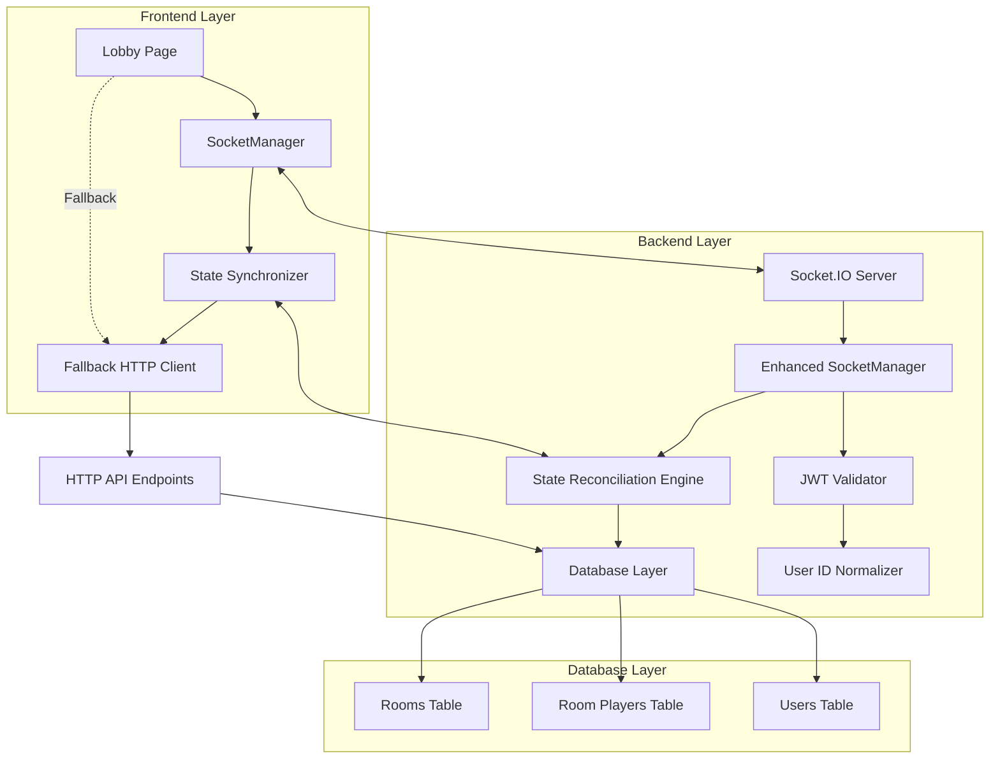

# Design Document

## Overview

This design addresses critical websocket synchronization issues in the multiplayer lobby system by implementing a comprehensive state management solution that ensures consistency between the database, websocket manager, and frontend clients. The solution focuses on fixing authentication inconsistencies, implementing reliable state reconciliation, and providing robust error handling with fallback mechanisms.

The current system suffers from user ID field inconsistencies (JWT uses `id` field while database uses `user_id`), websocket state desynchronization, and unreliable real-time updates. This design provides a systematic approach to resolve these issues while maintaining backward compatibility.

## Architecture

### Current System Analysis

The existing architecture consists of:
- **Frontend**: React-based lobby page with SocketManager for websocket communication
- **Backend**: Express server with Socket.IO websocket manager and MySQL database
- **Authentication**: JWT-based authentication with middleware validation
- **Database**: MySQL with `rooms`, `room_players`, and `users` tables

### Key Issues Identified

1. **User ID Inconsistency**: JWT tokens use `id` field while database uses `user_id` field
2. **State Desynchronization**: Websocket room state and database state can become inconsistent
3. **Connection Status Tracking**: Inaccurate player connection status affects game logic
4. **Error Handling**: Insufficient fallback mechanisms for websocket failures
5. **Race Conditions**: Multiple simultaneous state updates can cause conflicts

### Proposed Architecture Improvements



## Components and Interfaces

### 1. JWT Authentication Validator

**Purpose**: Ensure consistent user ID validation across all websocket connections and API operations.

**Interface**:
```javascript
class JWTValidator {
    validateToken(token): Promise<{userId: string, username: string, email: string}>
    validateUserExists(userId): Promise<boolean>
    normalizeUserId(tokenData, requestData): string
}
```

**Implementation Details**:
- Validates JWT token structure and expiration
- Verifies user ID from token exists in database
- Normalizes user ID fields consistently across the application
- Handles both `id` and `user_id` field variations

### 2. State Reconciliation Engine

**Purpose**: Maintain consistency between websocket state and database state with automatic conflict resolution.

**Interface**:
```javascript
class StateReconciliationEngine {
    reconcileRoomState(gameId): Promise<RoomState>
    detectStateInconsistencies(wsState, dbState): StateInconsistency[]
    resolveConflicts(inconsistencies): Promise<ResolvedState>
    schedulePeriodicReconciliation(interval): void
}
```

**Implementation Details**:
- Compares websocket room state with database state
- Uses database as source of truth for conflict resolution
- Implements atomic updates to prevent race conditions
- Provides rollback mechanisms for failed updates

### 3. Enhanced Connection Status Manager

**Purpose**: Accurately track player connection status and handle reconnection scenarios.

**Interface**:
```javascript
class EnhancedConnectionStatusManager {
    updatePlayerConnectionStatus(userId, isConnected): void
    getConnectedPlayers(gameId): Player[]
    handlePlayerReconnection(userId, gameId): Promise<void>
    cleanupDisconnectedPlayers(gameId): void
}
```

**Implementation Details**:
- Maintains real-time connection status for all players
- Handles graceful reconnection with state restoration
- Implements connection heartbeat monitoring
- Provides connection status broadcasting to all room members

### 4. Websocket Event Reliability Layer

**Purpose**: Ensure reliable delivery of websocket events with retry mechanisms and fallback options.

**Interface**:
```javascript
class WebsocketReliabilityLayer {
    emitWithRetry(event, data, retryOptions): Promise<boolean>
    handleEventFailure(event, data, error): void
    setupFallbackMechanisms(): void
    monitorEventDelivery(): void
}
```

**Implementation Details**:
- Implements exponential backoff retry strategy
- Provides HTTP API fallback for critical events
- Tracks event delivery success rates
- Handles websocket disconnection gracefully

### 5. Frontend State Synchronizer

**Purpose**: Maintain consistent state on the frontend with automatic synchronization and conflict resolution.

**Interface**:
```javascript
class FrontendStateSynchronizer {
    syncWithServer(): Promise<void>
    handleStateUpdate(serverState): void
    detectLocalStateConflicts(): StateConflict[]
    fallbackToHttpApi(): Promise<void>
}
```

**Implementation Details**:
- Periodically syncs local state with server state
- Handles websocket disconnection with HTTP API fallback
- Provides optimistic updates with rollback capability
- Implements state caching for offline scenarios

## Data Models

### Enhanced Room State Model

```javascript
interface RoomState {
    gameId: string;
    players: Map<string, PlayerState>;
    teams: {
        team1: string[];
        team2: string[];
    };
    status: 'waiting' | 'starting' | 'playing' | 'finished';
    hostId: string;
    createdAt: string;
    lastSyncAt: string;
    version: number; // For optimistic concurrency control
}

interface PlayerState {
    userId: string;
    username: string;
    socketId?: string;
    isReady: boolean;
    isConnected: boolean;
    teamAssignment: number | null;
    joinedAt: string;
    lastSeenAt: string;
}
```

### State Inconsistency Model

```javascript
interface StateInconsistency {
    type: 'player_missing' | 'ready_status_mismatch' | 'team_assignment_conflict' | 'host_mismatch';
    gameId: string;
    playerId?: string;
    websocketValue: any;
    databaseValue: any;
    severity: 'low' | 'medium' | 'high' | 'critical';
    timestamp: string;
}
```

### Authentication Context Model

```javascript
interface AuthenticationContext {
    userId: string; // Normalized user ID
    username: string;
    email: string;
    tokenValid: boolean;
    databaseUserExists: boolean;
    lastValidated: string;
}
```

## Error Handling

### Error Classification

1. **Authentication Errors**
   - Invalid JWT token
   - User ID mismatch between token and database
   - Expired token
   - User not found in database

2. **State Synchronization Errors**
   - Websocket state inconsistent with database
   - Race condition conflicts
   - Failed state updates
   - Connection timeout during sync

3. **Connection Errors**
   - Websocket disconnection
   - Network timeout
   - Server unavailable
   - Client-side connection issues

### Error Handling Strategies

```javascript
class ErrorHandlingStrategy {
    // Authentication error handling
    handleAuthenticationError(error, context) {
        switch(error.type) {
            case 'TOKEN_EXPIRED':
                return this.redirectToLogin();
            case 'USER_ID_MISMATCH':
                return this.refreshUserSession();
            case 'USER_NOT_FOUND':
                return this.handleOrphanedSession();
        }
    }
    
    // State synchronization error handling
    handleSyncError(error, gameId) {
        switch(error.severity) {
            case 'critical':
                return this.forceStateReconciliation(gameId);
            case 'high':
                return this.scheduleImmediateSync(gameId);
            case 'medium':
                return this.scheduleDelayedSync(gameId);
            case 'low':
                return this.logAndContinue(error);
        }
    }
    
    // Connection error handling
    handleConnectionError(error, context) {
        return {
            immediate: this.attemptReconnection(),
            fallback: this.switchToHttpApi(),
            recovery: this.schedulePeriodicRetry()
        };
    }
}
```

### Fallback Mechanisms

1. **Websocket to HTTP API Fallback**
   - Automatic detection of websocket failures
   - Seamless transition to HTTP polling
   - State synchronization via REST endpoints

2. **State Recovery Mechanisms**
   - Database state restoration on reconnection
   - Client-side state caching
   - Conflict resolution with server state

3. **User Experience Preservation**
   - Loading states during fallback operations
   - User notifications for connection issues
   - Graceful degradation of real-time features

## Testing Strategy

### Unit Testing

1. **JWT Validation Testing**
   - Token validation with various user ID formats
   - Database user existence verification
   - User ID normalization edge cases

2. **State Reconciliation Testing**
   - Websocket vs database state comparison
   - Conflict resolution algorithms
   - Race condition handling

3. **Connection Management Testing**
   - Player connection status tracking
   - Reconnection scenario handling
   - Cleanup of disconnected players

### Integration Testing

1. **End-to-End Lobby Flow Testing**
   - Complete user journey from join to game start
   - Multi-player interaction scenarios
   - Network failure simulation

2. **Websocket Reliability Testing**
   - Event delivery confirmation
   - Retry mechanism validation
   - Fallback activation testing

3. **State Consistency Testing**
   - Concurrent user action handling
   - Database-websocket synchronization
   - Cross-client state consistency

### Performance Testing

1. **Load Testing**
   - Multiple concurrent rooms
   - High-frequency state updates
   - Connection/disconnection stress testing

2. **Latency Testing**
   - Real-time update delivery times
   - State synchronization performance
   - Fallback mechanism response times

### Security Testing

1. **Authentication Security**
   - JWT token validation robustness
   - User ID spoofing prevention
   - Session hijacking protection

2. **Authorization Testing**
   - Host permission validation
   - Player action authorization
   - Room access control

## Implementation Phases

### Phase 1: Authentication Consistency (Requirements 7)
- Implement JWT user ID validation
- Create user ID normalization utilities
- Update all authentication touchpoints
- Add database user existence verification

### Phase 2: State Reconciliation Engine (Requirements 2, 8)
- Build state comparison algorithms
- Implement conflict resolution logic
- Create periodic reconciliation scheduler
- Add state versioning for optimistic concurrency

### Phase 3: Connection Status Enhancement (Requirements 5)
- Improve connection status tracking
- Implement heartbeat monitoring
- Add reconnection state restoration
- Create connection status broadcasting

### Phase 4: Websocket Reliability (Requirements 1, 3, 4, 6)
- Add event delivery confirmation
- Implement retry mechanisms with exponential backoff
- Create HTTP API fallback system
- Add comprehensive error handling

### Phase 5: Frontend Synchronization
- Implement client-side state synchronizer
- Add optimistic updates with rollback
- Create fallback UI states
- Implement state caching mechanisms

Each phase builds upon the previous one, ensuring incremental improvement while maintaining system stability throughout the implementation process.