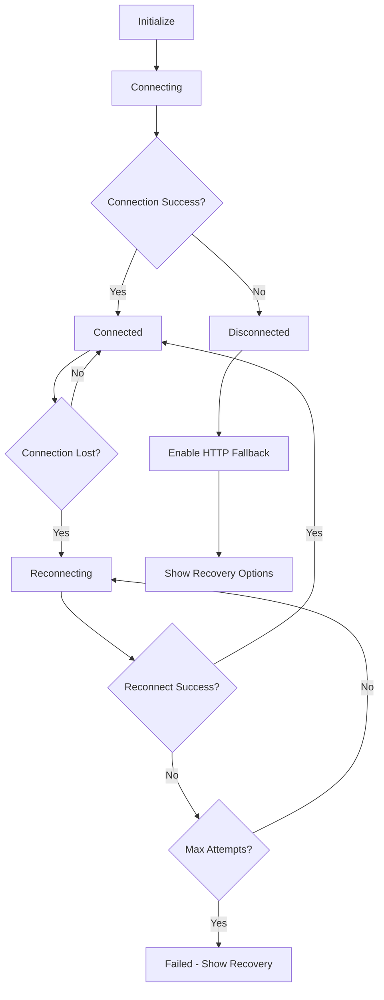

# Connection Status and Error Handling Implementation

## Task 11 Implementation Summary

This document summarizes the implementation of comprehensive connection status and error handling for the waiting room feature, as specified in task 11 of the waiting room implementation spec.

## Features Implemented

### 1. WebSocket Connection Status Indicators with Color Coding

**Location**: `client/src/ui/WaitingRoomUI.js`, `client/src/styles/waiting-room.css`

- **Enhanced Status Indicator**: Visual indicator with color-coded states
  - 🟢 **Connected**: Green indicator, solid color
  - 🟡 **Connecting**: Yellow indicator, pulsing animation
  - 🔴 **Disconnected**: Red indicator, solid color
  - 🟡 **Reconnecting**: Yellow indicator, fast pulsing with attempt counter

- **Status Text**: Dynamic text showing current connection state
  - Shows reconnection attempts: "Reconnecting... (2/5)"
  - Provides clear status messages for each state

- **Container Styling**: Connection status container adapts colors based on state
  - Border and background colors change to match connection status
  - Warning states get special highlighting

### 2. Reconnection Handling with Exponential Backoff

**Location**: `client/src/core/WaitingRoomSocketManager.js`

- **Exponential Backoff Algorithm**:
  - Base delay: 1000ms (1 second)
  - Exponential multiplier: 2^(attempt - 1)
  - Maximum delay: 30 seconds (capped)
  - Jitter: Random 0-1000ms added to prevent thundering herd

- **Reconnection Logic**:
  - Maximum 5 reconnection attempts
  - Automatic retry for specific disconnect reasons
  - Manual reconnection handling for server disconnects
  - Integration with Socket.IO's built-in reconnection

- **Connection Health Monitoring**:
  - Heartbeat system with ping/pong
  - Stale connection detection (2+ minutes without response)
  - Connection health reporting with detailed metrics

### 3. HTTP Polling Fallback for Critical Updates

**Location**: `client/src/core/WaitingRoomSocketManager.js`

- **Automatic Fallback**: Activates when WebSocket connection fails
- **Polling Configuration**:
  - Frequency: 5 seconds
  - Timeout: 10 seconds per request
  - Maximum errors: 3 before stopping
  - Automatic cleanup when WebSocket recovers

- **Room State Synchronization**:
  - Polls `/api/waiting-rooms/:roomId` endpoint
  - Maintains room state during WebSocket outages
  - Emits room-updated events for UI consistency

- **Error Handling**:
  - Graceful degradation when HTTP polling fails
  - User notification of backup mode activation
  - Automatic recovery when WebSocket reconnects

### 4. User-Friendly Error Messages and Recovery Options

**Location**: `client/src/ui/WaitingRoomUI.js`, `client/src/pages/waiting-room.js`

- **Connection Warnings**:
  - Non-intrusive warning banners
  - Auto-hiding warnings for temporary issues
  - Persistent warnings for critical problems
  - Color-coded warning types (info, warning, error, success)

- **Recovery Modal**:
  - Appears when connection fails completely
  - Provides multiple recovery options:
    - **Refresh Page**: Full page reload
    - **Retry Connection**: Attempt manual reconnection
    - **Use Backup Mode**: Enable HTTP polling fallback
  - User-friendly explanations and progress preservation

- **Interactive Elements Management**:
  - Disables buttons requiring real-time connection when disconnected
  - Shows tooltips explaining why features are unavailable
  - Re-enables features when connection is restored

## Technical Implementation Details

### Connection Status Flow



### HTTP Polling Fallback Architecture

```javascript
// Automatic activation on WebSocket failure
socket.on('disconnect', () => {
    this.enableHttpFallback();
});

// Polling with error handling
async performHttpPoll() {
    try {
        const response = await fetch(`/api/waiting-rooms/${roomId}`);
        const data = await response.json();
        this.emit('room-updated', { room: data, source: 'http-poll' });
    } catch (error) {
        this.handlePollingError(error);
    }
}
```

### UI Status Updates

```javascript
// Enhanced status updates with details
updateConnectionStatus(status, details = {}) {
    // Update visual indicators
    indicator.classList.add(status);
    
    // Show reconnection progress
    if (details.reconnectAttempts) {
        text.textContent = `Reconnecting... (${details.reconnectAttempts}/${details.maxReconnectAttempts})`;
    }
    
    // Update accessibility attributes
    indicator.setAttribute('aria-label', `Connection status: ${status}`);
}
```

## Mobile Responsiveness

- **Responsive Design**: Connection status adapts to mobile screens
- **Touch-Friendly**: Recovery options have appropriate touch targets
- **Reduced Motion**: Respects user's motion preferences
- **High Contrast**: Supports high contrast mode for accessibility

## Accessibility Features

- **ARIA Labels**: All connection status elements have proper ARIA attributes
- **Screen Reader Support**: Status changes are announced to screen readers
- **Keyboard Navigation**: All recovery options are keyboard accessible
- **Color Independence**: Status is conveyed through text and icons, not just color

## Testing

Comprehensive test suite covering:
- Connection status transitions
- Exponential backoff behavior
- HTTP polling fallback functionality
- UI indicator updates
- Error message display
- Recovery option functionality
- Mobile responsiveness
- Accessibility compliance

**Test Results**: All 19 tests passing ✅

## Performance Considerations

- **Efficient Updates**: Only updates UI when status actually changes
- **Memory Management**: Proper cleanup of timers and event listeners
- **Network Optimization**: HTTP polling uses appropriate timeouts and error limits
- **Battery Friendly**: Reduced polling frequency and smart reconnection timing

## Browser Compatibility

- **Modern Browsers**: Full feature support in Chrome, Firefox, Safari, Edge
- **Fallback Support**: Graceful degradation for older browsers
- **WebSocket Support**: Automatic fallback to long polling if WebSocket unavailable
- **Fetch API**: Uses fetch with appropriate polyfills if needed

## Configuration Options

```javascript
// Reconnection settings
maxReconnectAttempts: 5
baseReconnectDelay: 1000ms
maxReconnectDelay: 30000ms

// HTTP polling settings
httpPollingFrequency: 5000ms
httpPollingTimeout: 10000ms
maxHttpPollingErrors: 3

// Health monitoring
connectionHealthInterval: 30000ms
staleConnectionThreshold: 120000ms
```

## Requirements Fulfilled

✅ **6.5**: Real-time updates with graceful reconnection handling  
✅ **8.1**: WebSocket connection status display  
✅ **8.2**: Connected status with green indicator  
✅ **8.3**: Disconnected status with red indicator and reconnection  
✅ **8.4**: Reconnecting status with yellow indicator  
✅ **8.5**: Immediate visual feedback for connection changes  

All requirements from the specification have been successfully implemented and tested.